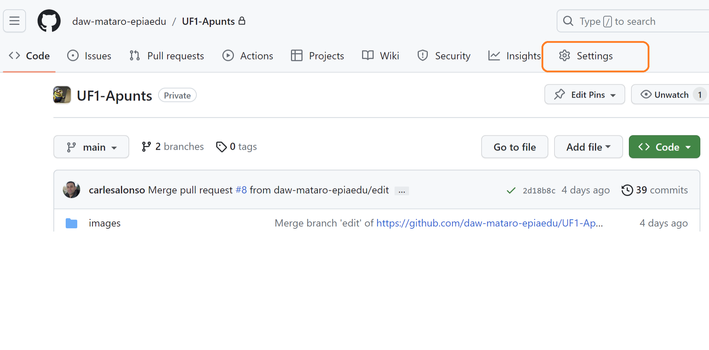
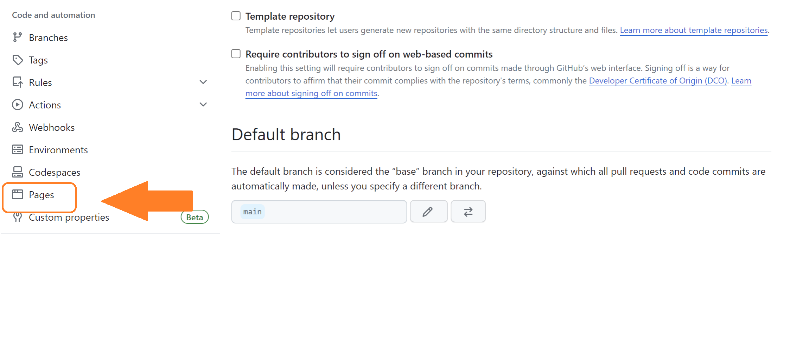
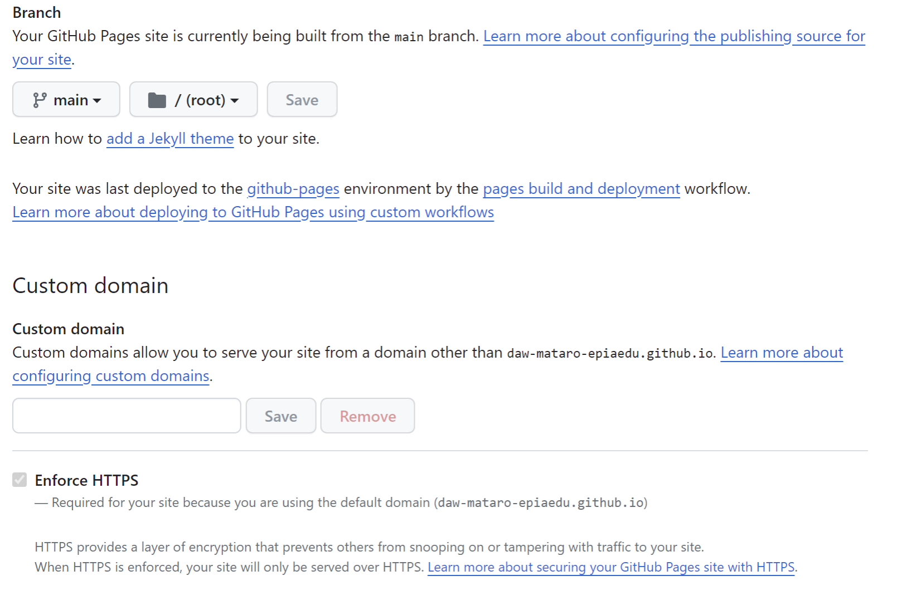

# Transferència de fitxers

- [Protocol FTP](#ftp-file-transfer-protocol--rfc-959)
- [Protocol FTPes](#ftpes-ftp-over-explicit-tlsssl--rfc-4217)
- [Protocol SFTP](#sftp-ssh-file-transfer-protocol--rfc-4253)
- [Desplegament continu (CD)](#desplegament-continu-cd)
- [Tornar a l'índex](/README.md)

Un cop hem desenvolupat la nostra pàgina web en local, hem de transferir-la al servidor remot. Per realitzar aquest procés, tradicionalment s'utilitzava el protocol FTP (File Transfer Protocol), però actualment, han aparegut altres protocols que ofereixen més seguretat i un desplegament molt més àgil, en consonància amb la filosofia de desplegament continu (CD).

## FTP. File Transfer Protocol- RFC 959

És un dels protocols més antics de Internet i serveix per transferir fitxers entre dos ordinadors. El protocol FTP utilitza dos ports: el port 21 per a la comunicació de comandes i el port 20 per a la transferència de dades. Aquest segon port és efímer, vol dir que es crea en el momenet de transferir i es tanca un cop l'arxiu s'ha enviat.

Així quan volem enviar un arxiu cap el servidor, el client amb la comanda `PUT` indica al servidor que vol pujar dades, el servidor es queda a l'escolta al port 20, per tal que el client es connecti. Com  he dit, un cop feta la transferència, el client tanca la connexió.

En el cas que el client vulgui descarregar un arxiu, `GET` el procediment és una mica més complicat. En el mode **actiu, el client obre un port efímer i envia la comanda `PORT` al servidor, indicant el port que ha obert. El servidor es connecta al port del client i envia les dades. Aquest mode té l'incovenient que si el client utilitza una adreça privada, el servidor no pot connectar-se.

En el mode **passiu**, el servidor obre un port efímer i envia la seva adreça IP i el port al client, el client es connecta al servidor i descarrega les dades. És el mode més utilitzat actualment.

El protocol FTP original presenta l'inconvenient que tot el trànsit es trasmet en clar, sense cap tipus de xifrat, per la qual cosa, si algú intercepta la comunicació, pot veure el contingut dels fitxers que s'estan transferint.

## FTPes. FTP over explicit TLS/SSL- RFC 4217

És una extensió del protocol FTP que utilitza TLS (Transport Layer Security) o SSL (Secure Sockets Layer) per xifrar les dades que es transfereixen. Aquest protocol utilitza el port 21 per a la comunicació de comandes i el port 990 per a la transferència de dades. En aquest cas es necesssita que el servidor tingui instal·lat un certificat digital.

## SFTP. SSH File Transfer Protocol- RFC 4253

És un protocol que utilitza SSH (Secure Shell) per a transferir fitxers de forma segura. Aquest protocol utilitza el port 22 per a la comunicació de comandes i de dades. En aquest cas es necesssita que el servidor tingui instal·lat un certificat digital. És un dels protocols més utilitzats actualment, entre altres coses perquè la major part dels servidors web tenen instal·lat un servidor SSH.

Tots aquests sistemes es basen en el desplegament manual de la pàgina web, però actualment, s'han desenvolupat sistemes que permeten automatitzar aquest procés, de manera que cada vegada que es realitza un commit al repositori, es desplega la pàgina web en el servidor remot.

## Desplegament continu (CD)

El desplegament continu (CD) és una pràctica de desenvolupament de software en la qual s'automatiza el desplegament de software cap el client, en aquest cas el servidor. Aquest procés es repeteix cada vegada que es realitza un commit al repositori. És la continuació de la integració contínua (CI).

Per a automatitzar aquest procés, s'utilitzen sistemes de control de versions com Git i sistemes de desplegament continu com Travis CI, GitHub Actions, Jenkins, CircleCI, etc.

### Exemple de transferir cap GitHub Pages

GitHub Pages és un servei de hosting gratuït per a pàgines web estàtiques. Per a utilitzar aquest servei, només cal crear un repositori amb el nom de usuari de GitHub i el nom del repositori, per exemple, si el nostre usuari és `daw-mataro-epiaedu` i el nom del repositori és `UF1-apunts`, la URL de la pàgina web serà `https://daw-mataro-epiaedu.github.io/UF1-Apunts/`.

Per a transferir la pàgina web a GitHub Pages, només cal afegir el contingut de la pàgina web al repostiori i activar GitHub Pages en la configuració del repositori.

Seleccionem al menú lateral, l'opció `Pages`.

A la secció `Build and deployment`, hem de seleccionar si volem desplegar des d'una branca (mètode tradicional) o directament aplicant `GitHub Actions`.

Seleccionem la branca `main` i el directori `root`, una limitació d'aquesta opció respecte les GitHub Actions, és que ens limita a desplegar des de la carpeta principal o des d'una carpeta anomenada `docs`.

Un aspecte interessant és que podem vincular de forma molt senzilla un domini propi a la pàgina web de GitHub Pages i que no ens haurem de preocupar de la seguretat, ja que GitHub Pages utilitza un certificat digital de Let's Encrypt.

